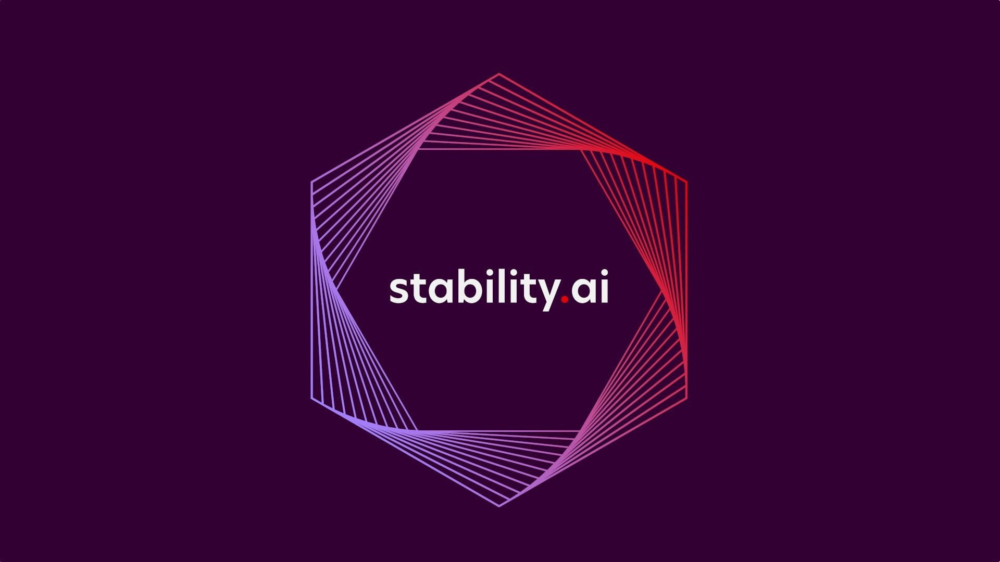

# Stability Image Generation


##### Stability Image Generation is a new AI image generation tool that can crate amazing images form just text prompt.

## Features
- ##### Generate Images from Text
- ##### High Quality
- ##### More Then 10 Style
- ##### Can add new styles on your own

## How it work !

- ##### Make sure you enter more descriptive prompt. As this is kind of new website, it is going to take time to produce HD image with less descriptive prompt. So, make sure you describe the image correctly that you want as output.
- ##### Try to select styles while creating your image. Check different style and see how output image looks like.

## Installation

##### First create your free api key from this website.

- ##### The original website [Official Documentation](https://api.stability.ai/docs#tag/v1generation/operation/textToImage)

##### Import The Package :
```dart
import 'package:stability_image_generation/stability_image_generation.dart';
```
##### Then init the AI class:
```dart
  final StabilityAI _ai = StabilityAI();
```
##### Get the Image as Uint8List (PNG Format):
```dart
  Future<Uint8List> _generate(String query) async {
    /// Call the generateImage method with the required parameters.
    Uint8List image = await _ai.generateImage(
      apiKey: apiKey,
      imageAIStyle: imageAIStyle,
      prompt: 'A boy in an old village',
    );
    return image;
  }

  ```
##### Display The Image With:
```dart
    return FutureBuilder<Uint8List>(
      // Call the generate() function to get the image data
      future: generate('YOUR TEXT'), 
      builder: (context, snapshot) {
        if (snapshot.connectionState == ConnectionState.waiting) {
          // While waiting for the image data, display a loading indicator
          return const CircularProgressIndicator();
        } else if (snapshot.hasError) {
          // If an error occurred while getting the image data, display an error
          return Text('Error: ${snapshot.error}');
        } else if (snapshot.hasData) {
          // If the image data is available, display the image using Image.memory()
          return Image.memory(snapshot.data!);
        } else {
          // If no data is available, display a placeholder or an empty container
          return Container();
        }
      },
    );
```
- ##### For more guide, check in the example folder
## License
```license
BSD 3-Clause License

Copyright (c) 2023 Karl Mathuthu
All rights reserved.

Redistribution and use in source and binary forms, with or without
modification, are permitted provided that the following conditions are met:

1. Redistributions of source code must retain the above copyright notice, this
   list of conditions and the following disclaimer.

2. Redistributions in binary form must reproduce the above copyright notice,
   this list of conditions and the following disclaimer in the documentation
   and/or other materials provided with the distribution.

3. Neither the name of the copyright holder nor the names of its
   contributors may be used to endorse or promote products derived from
   this software without specific prior written permission.

THIS SOFTWARE IS PROVIDED BY THE COPYRIGHT HOLDERS AND CONTRIBUTORS "AS IS"
AND ANY EXPRESS OR IMPLIED WARRANTIES, INCLUDING, BUT NOT LIMITED TO, THE
IMPLIED WARRANTIES OF MERCHANTABILITY AND FITNESS FOR A PARTICULAR PURPOSE ARE
DISCLAIMED. IN NO EVENT SHALL THE COPYRIGHT HOLDER OR CONTRIBUTORS BE LIABLE
FOR ANY DIRECT, INDIRECT, INCIDENTAL, SPECIAL, EXEMPLARY, OR CONSEQUENTIAL
DAMAGES (INCLUDING, BUT NOT LIMITED TO, PROCUREMENT OF SUBSTITUTE GOODS OR
SERVICES; LOSS OF USE, DATA, OR PROFITS; OR BUSINESS INTERRUPTION) HOWEVER
CAUSED AND ON ANY THEORY OF LIABILITY, WHETHER IN CONTRACT, STRICT LIABILITY,
OR TORT (INCLUDING NEGLIGENCE OR OTHERWISE) ARISING IN ANY WAY OUT OF THE USE
OF THIS SOFTWARE, EVEN IF ADVISED OF THE POSSIBILITY OF SUCH DAMAGE.
```
## Developers
#### Made with ❤️ by Karl Mathuhu